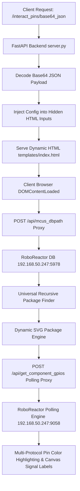

# RoboReactor Dynamic Pinout Visualizer

A high-performance, URL-driven interactive pinout visualization engine built with **FastAPI**, **Vanilla JavaScript**, and **Dynamic SVG Rendering**. The visualizer automatically parses microcontroller package structures and displays real-time GPIO protocol statuses without requiring manual user input.

---

## 📌 Features & Architecture



### Key Highlights
1. **URL-Driven Base64 Pre-Loading**: Instant page rendering driven by URL parameter `/interact_pins/<base64_json>`.
2. **Zero-Manual-Input UI**: Clean, streamlined interface with text inputs hidden; features a dedicated **Render Live Status** button and an informative **Live Status Legend**.
3. **Universal MCU Package Engine**: Recursively parses any IC package layout (`LQFP`, `QFN`, `DIP`, `SOIC`, `BGA`, `TSSOP`) and dynamically calculates geometry, pin counts, viewbox scaling, and label positioning.
4. **Multi-Protocol Color Matrix**: Color-codes pins based on peripheral protocols (**I2C**, **SPI**, **CAN-BUS**, **UART**, **PWM**, **ADC**, **GPIO**, **VCC**, **GND**, **NC**).
5. **On-Canvas Signal Labels**: Displays active signal names directly on SVG pin labels (e.g. `PA8 [SCL]`, `PC9 [SDA]`).
6. **Interactive Hover & Lock Tooltip**: Highlights pin number, pin name, target module, protocol, and live connection status.

---

## 🚀 Quick Start & Running Locally

### Prerequisites
- Python 3.8+
- `fastapi`, `uvicorn`, `httpx`

```bash
cd /home/kornbotdev/.gemini/antigravity/scratch/interactive_pinout
pip install fastapi uvicorn httpx
python3 server.py
```

Access the default interactive endpoint in your browser:
```text
http://127.0.0.1:8000/interact_pins/eyJlbWFpbCI6ICJrb3JuYm90MzgwQGhvdG1haWwuY29tIiwgInByb2plY3RfbmFtZSI6ICJIZXhib3RfZGVzaWduIiwgIm1jdXMiOiAiU1RNMzJGNDAxUkVUNiJ9
```

---

## 🔑 URL Base64 Payload Schema

URLs must follow the pattern:
```text
http://<host>:<port>/interact_pins/<BASE64_ENCODED_JSON>
```

### Payload Format (JSON)
```json
{
  "email": "user@example.com",
  "project_name": "Hexbot_design",
  "mcus": "STM32F401RET6"
}
```

### Python Generator Example
```python
import base64
import json

payload = {
    "email": "kornbot380@hotmail.com",
    "project_name": "Hexbot_design",
    "mcus": "STM32F401RET6"
}

encoded_b64 = base64.b64encode(json.dumps(payload).encode("utf-8")).decode("utf-8")
url = f"http://127.0.0.1:8000/interact_pins/{encoded_b64}"
print("Generated URL:", url)
```

---

## 🎨 Multi-Protocol Pin Color Matrix

| Protocol | Signal Keywords | CSS Variable | Visual Color | Description |
|:---:|:---|:---:|:---:|:---|
| **I2C** | `SCL`, `SDA` | `var(--pin-i2c)` | 🔵 **Vibrant Blue** (`#3b82f6`) | I2C Bus communications |
| **SPI** | `SCK`, `MISO`, `MOSI`, `CS` | `var(--pin-spi)` | 🟣 **Purple** (`#a855f7`) | High-speed SPI Bus |
| **CAN** | `CAN_TX`, `CAN_RX` | `var(--pin-can)` | 🟡 **Amber Gold** (`#f59e0b`) | Controller Area Network |
| **UART** | `TX`, `RX` | `var(--pin-uart)` | 🩵 **Cyan** (`#06b6d4`) | Serial communication lines |
| **PWM** | `PWM`, `SERVO`, `MOTOR` | `var(--pin-pwm)` | 🟠 **Orange** (`#f97316`) | Pulse-width modulation |
| **ADC** | `ADC`, `ANALOG`, `READ` | `var(--pin-adc)` | 🩷 **Pink** (`#ec4899`) | Analog sensor inputs |
| **GPIO** | `DIGITAL`, `IO`, `GPIO` | `var(--pin-active)` | 🟢 **Emerald Green** (`#22c55e`) | General digital I/O |
| **VCC** | `VDD`, `VBAT`, `VREF+` | `var(--pin-power)` | 🔴 **Red** (`#ef4444`) | Positive power rails |
| **GND** | `VSS`, `VSSA` | `var(--pin-gnd)` | 🟡 **Yellow** (`#eab308`) | Circuit ground reference |
| **NC** | Unassigned | `var(--pin-unused)` | ⬛ **Slate Gray** (`#475569`) | Unconnected pins |

---

## 📡 API Endpoint Reference

### 1. `GET /`
Redirects root traffic to the default base64 interactive pinout URL.

### 2. `GET /interact_pins/{encoded_data}`
Decodes base64 payload and serves `templates/index.html` pre-populated with hidden input attributes:
```html
<input type="hidden" id="api-email" value="user@example.com">
<input type="hidden" id="api-project" value="Hexbot_design">
<input type="hidden" id="api-mcu" value="STM32F401RET6">
```

### 3. `POST /api/mcus_dbpath` (Proxy)
Forwards requests to the backend database at `http://192.168.50.247:5978/mcus_dbpath` to retrieve chip package definitions.

### 4. `POST /api/get_component_gpios` (Proxy)
Forwards requests to the backend polling engine at `http://192.168.50.247:9058/get_component_gpios` to fetch real-time GPIO assignments.

> **Note**: In `server.py`, setting `USE_MOCK_TEST_DATA = True` enables multi-protocol test data offline, while `USE_MOCK_TEST_DATA = False` operates in Production mode against live hardware.

---

## ⚙️ Universal MCU Package Layout Math

The client-side SVG engine dynamically computes pin layouts for any pin count:

$$\text{pinsPerSide} = \left\lceil \frac{\text{totalPins}}{4} \right\rceil$$

$$\text{bodySize} = (\text{pinsPerSide} \times 20\text{px}) + 40\text{px}$$

- **Left Side**: Pins $1 \to \text{pinsPerSide}$
- **Bottom Side**: Pins $(\text{pinsPerSide}+1) \to (2 \times \text{pinsPerSide})$
- **Right Side**: Pins $(2 \times \text{pinsPerSide}+1) \to (3 \times \text{pinsPerSide})$
- **Top Side**: Pins $(3 \times \text{pinsPerSide}+1) \to (4 \times \text{pinsPerSide})$

---

## 🛡️ Production Deployment Guidelines

### 1. Systemd Service Setup (`/etc/systemd/system/roboreactor-pinout.service`)
```ini
[Unit]
Description=RoboReactor Dynamic Pinout Visualizer
After=network.target

[Service]
User=kornbotdev
WorkingDirectory=/home/kornbotdev/.gemini/antigravity/scratch/interactive_pinout
ExecStart=/usr/local/bin/uvicorn server:app --host 0.0.0.0 --port 8000 --workers 4
Restart=always

[Install]
WantedBy=multi-user.target
```

### 2. Nginx Reverse Proxy Configuration
```nginx
server {
    listen 80;
    server_name pinout.roboreactor.com;

    location / {
        proxy_pass http://127.0.0.1:8000;
        proxy_set_header Host $host;
        proxy_set_header X-Real-IP $remote_addr;
        proxy_set_header X-Forwarded-For $proxy_add_x_forwarded_for;
        proxy_set_header X-Forwarded-Proto $scheme;
    }
}
```
