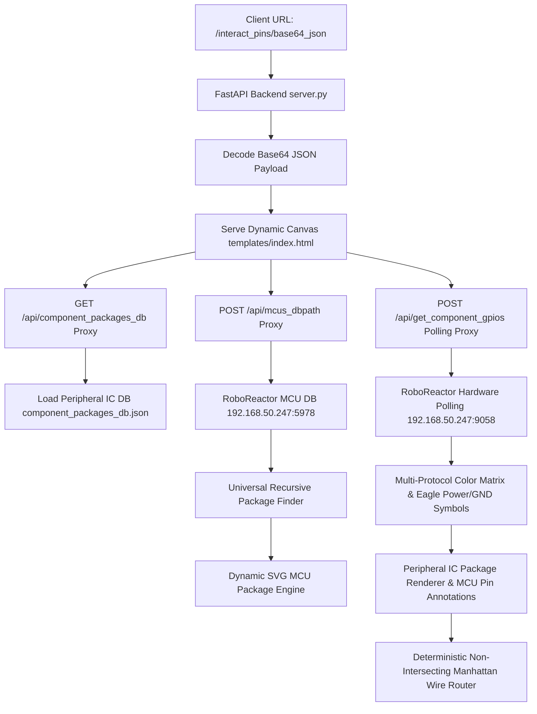

# RoboReactor Dynamic Multi-Component Circuit Schematic & Pinout Visualizer

A high-performance, production-ready interactive circuit schematic and microcontroller pinout visualization engine built with **FastAPI**, **Vanilla JavaScript**, and **Dynamic SVG Rendering**. The visualizer automatically renders main MCU IC packages alongside peripheral component chips (`TCA9548A`, `PCA9685`, `ICM20948`, `Radar Modules`) with PCB-grade schematic power/ground symbols, target MCU pin annotations, and non-intersecting Manhattan wire routing.

---

## 📌 Architecture & Feature Pipeline



---

## 🗺️ Codebase Map & Feature File Locations

| Feature / Module | File Location | Key Function / Variable | Description |
| :--- | :--- | :--- | :--- |
| **FastAPI Server & Proxy** | [`server.py`](file:///home/kornbotdev/.gemini/antigravity/scratch/interactive_pinout/server.py) | `app`, `/api/get_component_gpios`, `/api/component_packages_db` | Handles base64 URL routing, CORS proxying, and peripheral DB serving. |
| **Peripheral Package DB** | [`component_packages_db.json`](file:///home/kornbotdev/.gemini/antigravity/scratch/interactive_pinout/component_packages_db.json) | Root JSON schema | Stores complete pin maps, pin numbers, and package types (TSSOP, QFN, DIP). |
| **MCU Package Engine** | [`templates/index.html`](file:///home/kornbotdev/.gemini/antigravity/scratch/interactive_pinout/templates/index.html) | `searchPackage`, `renderPackage` | Recursively calculates geometry, pin count, and viewbox scale for any MCU. |
| **Eagle PCB Symbols** | [`templates/index.html`](file:///home/kornbotdev/.gemini/antigravity/scratch/interactive_pinout/templates/index.html) | `renderPowerGndSymbols` | Draws Red VCC Arrows (`▲`) and Yellow Ground Bars (`⏚`) on supply pins. |
| **Multi-Protocol Engine** | [`templates/index.html`](file:///home/kornbotdev/.gemini/antigravity/scratch/interactive_pinout/templates/index.html) | `parseProtocols` | Parses I2C, SPI, CAN, UART, PWM, ADC, and GPIO signals from live database response. |
| **Peripheral Chip Renderer** | [`templates/index.html`](file:///home/kornbotdev/.gemini/antigravity/scratch/interactive_pinout/templates/index.html) | `renderConnectedComponentChips` | Renders full IC chip bodies, Pin 1 indicators, package titles, and complete pinout maps. |
| **MCU Target Pin Labels** | [`templates/index.html`](file:///home/kornbotdev/.gemini/antigravity/scratch/interactive_pinout/templates/index.html) | `displayLabel` annotation | Annotates target MCU pins directly on component pins (e.g. `22:SCL ➔ MCU [PA8]`). |
| **Non-Intersecting Router** | [`templates/index.html`](file:///home/kornbotdev/.gemini/antigravity/scratch/interactive_pinout/templates/index.html) | `drawDeterministicWireRoute` | Manhattan orthogonal 3-segment path engine with $14px$ clearance channel offsets. |

---

## 🎨 Multi-Protocol Color Matrix

| Protocol | Keyword Matchers | CSS Variable | Color | Description |
|:---:|:---|:---:|:---:|:---|
| **I2C** | `I2C`, `I2C_MUX`, `SCL`, `SDA` | `var(--pin-i2c)` | 🔵 **Blue** | I2C Bus master & channel communication lines |
| **SPI** | `SPI`, `SCK`, `MISO`, `MOSI`, `CS` | `var(--pin-spi)` | 🟣 **Purple** | High-speed Serial Peripheral Interface |
| **CAN** | `CAN`, `CANBUS`, `CAN_TX`, `CAN_RX` | `var(--pin-can)` | 🟡 **Gold** | Controller Area Network bus |
| **UART** | `UART`, `USART`, `TX`, `RX` | `var(--pin-uart)` | 🩵 **Cyan** | Serial Communication TX/RX lines |
| **PWM** | `PWM`, `SERVO`, `MOTOR` | `var(--pin-pwm)` | 🟠 **Orange** | Pulse-Width Modulation output |
| **ADC** | `ADC`, `ANALOG`, `READ` | `var(--pin-adc)` | 🩷 **Pink** | Analog sensor input lines |
| **GPIO** | `GPIO`, `DIGITAL`, `IO`, `PIN` | `var(--pin-active)` | 🟢 **Green** | General-purpose digital I/O |
| **Power** | `VCC`, `VDD`, `VBAT`, `VREF+` | `var(--pin-power)` | 🔴 **Red Arrow `▲`** | Positive supply rails |
| **Ground** | `GND`, `VSS`, `VSSA` | `var(--pin-gnd)` | 🟡 **Yellow Bar `⏚`** | Ground reference rails |

---

## 📐 Deterministic Non-Intersecting Wire Routing Math

The routing algorithm calculates orthogonal SVG Manhattan paths between source MCU pins $(X_1, Y_1)$ and target component pins $(X_2, Y_2)$:

$$channelX = X_1 \pm (60px + i 	imes 14px)$$

$$topChannelY = \min(Y_1, Y_2, chipTopY) - 35px - (i 	imes 14px)$$

### Outer-Side Routing Path (Right Side Pins):
$$Path:  (X_1, Y_1) \longrightarrow (channelX, Y_1) \longrightarrow (channelX, topChannelY) \longrightarrow (outerRightX, topChannelY) \longrightarrow (outerRightX, Y_2) \longrightarrow (X_2, Y_2)$$

- **Clearance Spacing**: Parallel traces maintain $14px$ clearance.
- **Zero Intersections**: Wires never cross intermediate IC pins, chip bodies, or other traces.

---

## 🚀 Quick Start & Running Production Server

```bash
cd /home/kornbotdev/.gemini/antigravity/scratch/interactive_pinout
pip install fastapi uvicorn httpx
python3 -m uvicorn server:app --host 0.0.0.0 --port 8000
```

Access the dynamic visualizer in your browser:
```text
http://127.0.0.1:8000/interact_pins/eyJlbWFpbCI6ICJrb3JuYm90MzgwQGhvdG1haWwuY29tIiwgInByb2plY3RfbmFtZSI6ICJIZXhib3RfZGVzaWduIiwgIm1jdXMiOiAiU1RNMzJGNDAxUkVUNiJ9
```

---

## 🔑 Base64 URL Payload Schema

URL format: `/interact_pins/<BASE64_JSON>`

```json
{
  "email": "kornbot380@hotmail.com",
  "project_name": "Hexbot_design",
  "mcus": "STM32F401RET6"
}
```
